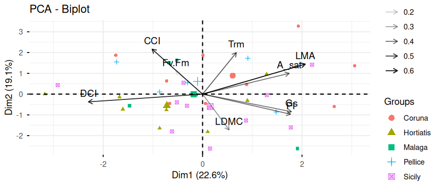
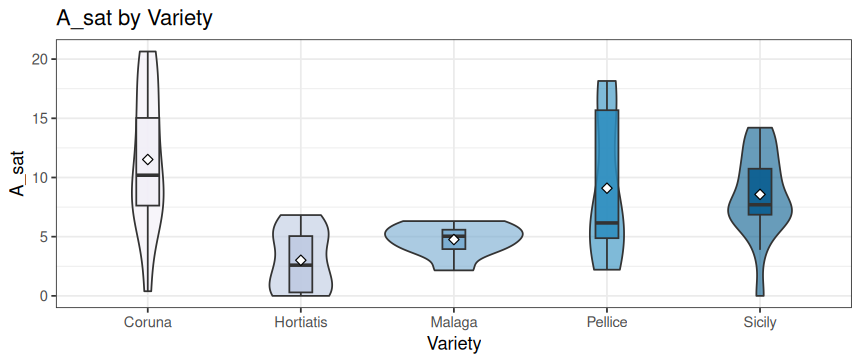
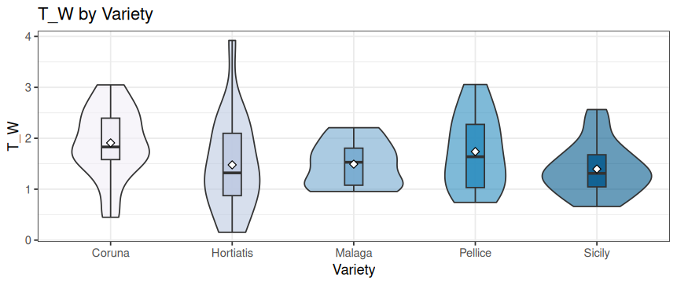
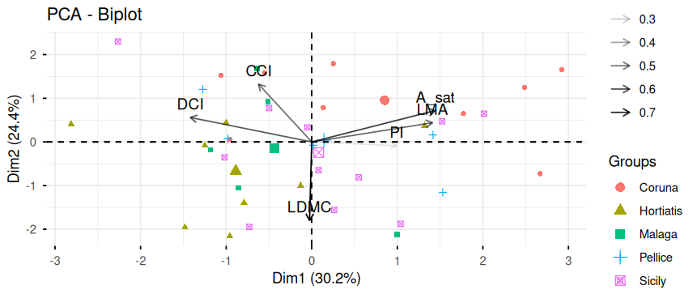
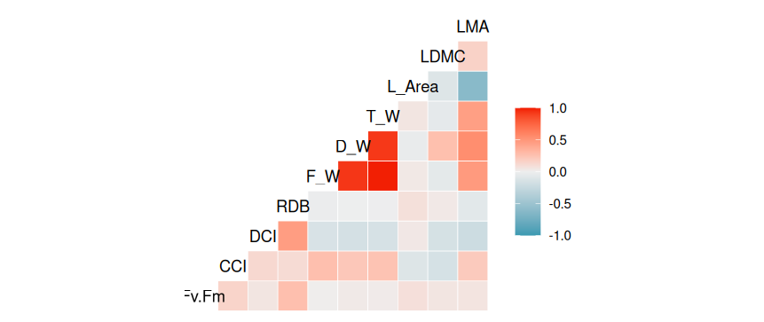

# Plant Physiology and Leaf Damage Analysis in R

## About the project

This project was completed during my internship at **ELGO Demeter**, in cooperation with **Aristotle University of Thessaloniki**, while I was a student at the **University of the Aegean**.

The project focused on analysing the effects of infestation by the **Asian Chestnut Gall Wasp (*Dryocosmus kuriphilus*)** on the physiology and morphology of *Castanea sativa* leaves, as well as differences between chestnut provenances and countries of origin.

The analysis was performed in **R**, using statistical tests, visualisation, regression models, mixed-effects models, correlation analysis and Principal Component Analysis (PCA).

---

## Data and reproducibility

The synthetic datasets (`Analisi_Sfika_synthetic.csv` and `Analisi_Physiologia_synthetic.csv`) were generated using `generate_synthetic_data.R`.

The synthetic data reproduce the **statistical structure** of the original data.

The analysis code has also been **rewritten from scratch** rather than reproducing the original internship report verbatim. The statistical methods, test choices and overall interpretation follow the original study, while the implementation is new.

> **Important:** The original field measurements are not included in this repository. They remain the intellectual property of the University of the Aegean, ELGO Demeter and Aristotle University of Thessaloniki. The results shown here are therefore intended to demonstrate the analysis workflow using synthetic data and should not be interpreted as results from the original field dataset.

---

## Overview

The Asian Chestnut Gall Wasp (*Dryocosmus kuriphilus* Yasumatsu, 1951; Hymenoptera: Cynipidae) is an invasive species that originated in China and reached Europe through Italy in 2002. It was first recorded in Greece in 2014.

The insect induces characteristic galls on chestnut (*Castanea sativa* Mill.) buds and shoots, which can affect leaf development and plant physiology.

This study examines the relationship between infestation, leaf damage, and physiological and morphological traits across **five provenances from three countries: Greece, Italy and Spain**. The plants were grown together in a **common-garden plantation**, reducing the influence of differences in environmental conditions between locations.

---

## Research Questions

1. Does infestation severity, measured using the **Damage Composite Index (DCI)**, differ significantly between provenances or countries of origin?
2. Do **reactivated dormant buds (RDB), gall counts and dead shoots** differ between provenances?
3. Are physiological leaf traits such as **CCI, A_sat, Fv/Fm and PI** affected by provenance or infestation level?
4. Which morphological traits, including **LMA, LDMC, leaf area and leaf weight**, are associated with infestation severity?
5. What is the multivariate structure of the relationships between leaf traits and DCI?

---

## Main Results

### Damage and infestation

The **Damage Composite Index (DCI)** showed some variation between varieties, but no statistically significant differences were found between varieties or countries.

Overall, the results suggest that **infestation and leaf damage levels were relatively similar across the groups**, despite some individual variation in damage.

The individual damage-related variables, including RDB, dead shoots, galls and other infestation indicators, also did not show significant overall differences between the groups.

<div align="center">

</div>

---

### Physiological differences

In contrast to the overall damage measures, some physiological traits showed clearer differences between varieties and countries.

**A_sat (photosynthetic assimilation)** showed statistically significant differences between both varieties and countries.

<div align="center">

</div>

**LDMC (Leaf Dry Matter Content)** also showed significant differences between varieties and countries. In the variety comparison, a significant difference was observed between **Hortiatis and Coruna**, while the country comparison showed a significant difference between **Spain and Greece**.

<div align="center">

</div>

Other traits, including **CCI** and **leaf area**, did not show statistically significant differences between the groups.

---

### Principal Component Analysis

Principal Component Analysis (PCA) was used to look at the data as a whole and identify the main patterns among the physiological, morphological and damage-related measurements.

The first three components of the reduced PCA explained approximately **73% of the total variation**.

The main patterns were associated with variables such as **A_sat, LMA, CCI, LDMC and DCI**, showing how different plant traits contributed to the overall variation between plants.

<div align="center">

</div>

The PCA provides a broader view of the relationships between the measurements rather than testing whether one specific group is statistically different from another.

---

### Correlations

Correlation analysis was used to examine relationships between physiological traits and damage-related variables.

Most direct relationships between **DCI and physiological traits were relatively weak**. A clearer negative relationship was observed between **DCI and sprouts**, meaning that plants with higher damage tended to have fewer sprouts in the synthetic dataset.

<div align="center">

</div>

---

## Overall Conclusion

Overall, the analysis showed that **physiological traits varied more clearly between varieties and countries than the overall infestation level**.

The **Damage Composite Index did not show a significant difference between groups**, suggesting that the overall level of infestation was relatively similar across the provenances and countries represented in the analysis.

In contrast, traits such as **photosynthetic assimilation (A_sat)** and **LDMC** showed significant differences between groups.

The PCA and correlation analyses provided an additional overview of how physiological, morphological and damage-related measurements were related.

Because the repository uses synthetic data, these findings demonstrate the **statistical workflow and structure of the original analysis**, rather than providing biological conclusions about the original field populations.

---

## Methods and Tools

The analysis was performed in **R**, using packages including:

* `tidyverse`
* `ggplot2`
* `car`
* `FactoMineR`
* `factoextra`
* `lme4`
* `lmerTest`
* `sjPlot`
* `GGally`
* `gplots`
* `wordcloud2`

The workflow included:

* Descriptive statistics and visualisation
* ANOVA and Welch's ANOVA
* Kruskal–Wallis tests
* Levene's and Shapiro–Wilk tests
* Tukey post-hoc comparisons
* Principal Component Analysis (PCA)
* Correlation analysis
* Linear regression
* Linear mixed-effects models
* Damage Composite Index analysis

---

## Repository Structure

```text
Plant-Physiology-R/
│
├── README.md
├── generate_synthetic_data.R
├── analysis.R
│
├── Analisi_Physiologia_synthetic.csv
├── Analisi_Sfika_synthetic.csv
│
└── figures/
    ├── asat_by_variety.png
    ├── ldmc_by_variety.png
    ├── dci_by_variety.png
    ├── pca_biplot.png
    └── correlation_matrix.png
```

## Reproducibility

The repository contains the synthetic datasets and R scripts required to reproduce the analysis workflow.

The synthetic data allow the statistical structure of the analysis to be demonstrated without exposing the original field measurements.

The original measurements and R script are not included in this repository.
